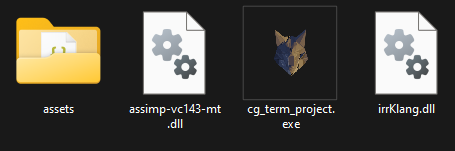

# 빌드 가이드

1. 환경에 맞는 `/utils/lib` 폴더를 설정합니다.
2. 컴파일러 옵션은 `c++20/release`, `/bigobj`로 설정합니다.
   - 윈도우의 경우 Visual Studio로 `.sln`파일을 열면 이미 설정되어있습니다.

# 실행 가이드

windows 기준, 실행파일과 함께 `assets`폴더, assimp dll파일, irrKlang dll파일이 있어야 실행 가능합니다.
