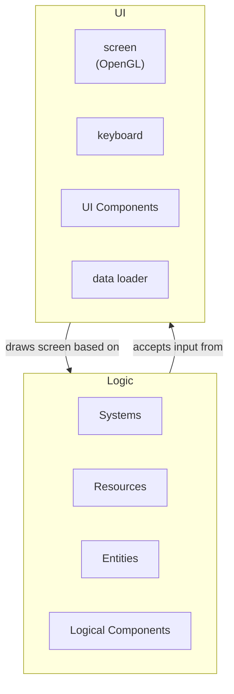
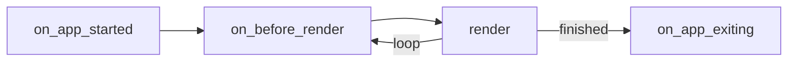
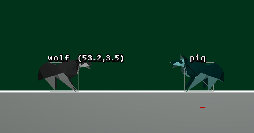

# Application Anatomy



프로젝트는 크게 Logic, UI 두 파트로 구성되어있다. Logic 파트는 ECS(entity component system) 프레임워크로 작성되어있다. UI파트는 GLFW로 작성되어있다.

Logic파트는 애플리케이션의 논리적인 구성을 서술한다. UI파트는 그러한 Logic파트를 기반으로 화면을 그린다. 또, UI파트는 사용자의 입력을 Logic파트에 전달한다.

# ECS 개요

다음 object를 예시로 생각해본다.

```json
{
  "entity_id": 1,
  "name": "Alice",
  "position_component": 0,
  "velocity_component": 10
}
```

Alice는 현재 원점에 있고, 양의 방향으로 10의 속도로 움직인다. 이 로직을 코드로 옮기면 다음과 같다.

```ts
function apply_velocity(bodies: EntitiesWith<Position, Velocity>) {
  for (const body of bodies) {
    body.position_component += body.velocity_component;
  }
}
```

여기서 `"entity_id": 1`인 object가 entity, `"position_component"`와 같은 프로퍼티를 component, 그리고 `apply_velocity`와 같은 로직을 system이라 한다. ECS는 이 entity, component, system의 세 개념으로 애플리케이션 로직을 기술하는 프레임워크이다.

system의 파라미터를 보자. 위의 `EntitiesWith<Position, Velocity>`는 `"position_component"`와 `"velocity_component"`를 가진 entity들을 가져오는 쿼리이다. ECS 프레임워크는 이 파라미터를 보고, 쿼리 결과를 구성해 해당 system에 건내준다. 이와 같이 데이터를 선언하면 자동으로 구성해 건내주는 것을 dependency injection기법이라고도 부른다.

Alice와 함께 다음 entity도 있다고 생각해본다.

```json
{
  "entity_id": 2,
  "name": "Bob",
  "position_component": 10
}
```

Bob은 `"position_component"`을 가지고 있지만 `"velocity_component"`를 가지고 있지 않다. 따라서 `apply_velocity`는 Alice에게만 적용되고, Bob과 Alice는 다음 순간 같은 점에서 만날것이다.

# ECS 구현

본 프로젝트에선 이러한 ECS프레임워크를 c++ template을 통해 구현했다. 또, 컨벤션에 따라 글로벌 변수처럼 작용하는 resource라는 개념도 추가했다. Resource는 특정 entity에 종속되지 않은 싱글톤 component라고 생각할수 있다. 애플리케이션에서 선언한 component는 `/cg_term_project/entities/prelude.hpp`에 정리되어있다.

system에서 사용하는 쿼리는 5가지가 구현되어있다.

- `EntitiesWith<C1, C2, ...>`: 읽기전용인 컴포넌트 `C1`, `C2`, ... 을 가진 엔티티들을 가져온다.
- `EntitiesWithWritable<C1, C2, ...>`: 수정가능한 컴포넌트 `C1`, `C2`, ... 을 가진 엔티티들을 가져온다.
- `R`: 읽기전용인 리소스 `R`을 가져온다.
- `Writable<R>`: 수정가능한 리소스 `R`을 가져온다.
- `EntityApi`: 엔티티의 추가, 삭제 인터페이스를 가져온다.

애플리케이션에서 선언한 system은 `/cg_term_project/entities/systems/*.hpp`에 정리되어있다.

## 예시1

```c++
void print_console(
    ecs::EntitiesWith<Body, LocomotionWalking> walking_characters,
    Elapsed elapsed
) {
    // 현재 시간(ticks)을 출력한다.
	std::cout << "current: " << elapsed.ticks << std::endl;
	for (auto& [_, body, locomotion] : walking_characters) {
        // 걸어다니는 캐릭터의 좌표를 출력한다.(날아다니는 캐릭터는 해당되지 않는다.)
		std::cout << body->x << ", " << body->y << std::endl;
	}
}
```

## 예시2

```c++
void update_elapsed(
	ecs::Writable<Elapsed> elapsed, ecs::EntityApi api,
	ecs::EntitiesWithWritable<Life> mortals
) {
    // 시간을 1tick만큼 진행시킨다.
	elapsed->ticks++;
	for (auto& [id, life] : mortals) {
        // life 컴포넌트가 있는 엔티티(mortals)에 대해,
        // 수명이 끝났을 경우 삭제한다.
		if (elapsed->ticks > life->until) api.remove(id);
	}
}
```

# UI개요

GLFW를 사용해 다음 lifecycle을 구성했다.



`UiComponent`는 각 lifecycle stage에서 실행될 로직을 선언한다. 사용하지 않는 stage는 생략할수 있다. UI에 대한 피쳐는 이 `UiComponent`를 만들어서 구현한다. 애플리케이션에서 구현한 `UiComponent`는 `/cg_term_project/ui/components/*.hpp`에 정리되어있다.

## 예시

```c++

UiComponent stage_component() {
	UiComponent c;

	c.render = [] {
		auto& cube = fetch_model("assets/cube.dae");
		auto& shader = fetch_shader("paper");
		shader.use();

		auto render_data = fetch<RenderData>();
		auto simulation_elapsed = render_data->simulation_elapsed();
		auto world = render_data->world;

		shader.setVec3("color1", 1, 1, 1);
		for (auto& [id, floor, body] : world->get_entities_with<Floor, Body>()) {
			auto trans = glm::translate(glm::mat4{ 1 }, glm::vec3(body->x, body->y, 0));
			trans = glm::scale(trans, glm::vec3(body->w, body->h, 1));
			shader.setMat4("model", trans);
			cube.Draw(shader);
		}
		};
	return c;
}
```

# paper shader

색종이를 표현하기 위해 사용하는 쉐이더이다. 앞면 색(`color1`)과 뒷면 색(`color2`)을 설정할수 있다. 블랜더에서 모델의 면(face)를 선택하고 노말을 뒤집으면(flip normal) 두 색을 서로 바꿀 수 있다.

## 예시



```c++
shader.use();
shader.setVec3("color1", 0.5f, 0.8f, 0.8f);
shader.setVec3("color2", 0, 0.2f, 0.2f);
shader.setMat4("model", trans);
model.Draw(shader);
```
