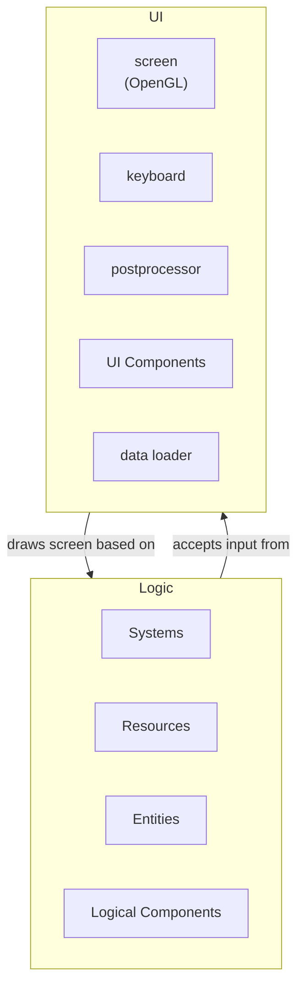

<center>
Term Project Report (Computer Graphics, Spring, 2024)
</center>
<center><h1>
Title: The Three Little Pigs
</h1></center>

## 1. 요약

동화 아기 돼지 삼형제 이야기를 베이스로 한 게임입니다.
아기돼지 삼형제는 늑대의 생일케익을 맘대로 먹어버립니다.
늑대는 화가 났지만, 상냥하게 아기돼지들을 타이릅니다.
반성한 아기돼지들은, 몰래 케익을 굽는 법을 익혀서, 늑대의 다음 생일에 서프라이즈로 케익을 선물합니다.

그래픽적으론, 마치 종이 인형이 살아 움직이는듯이 보이도록 구성하여 게임이 동화 속 이야기임을 표현했습니다.
카메라에는 관성을 시뮬레이션 하는 형태로 주인공인 늑대의 움직임을 쫓아 장면을 생동감있게 보여줍니다.

게임은 간단한 퍼즐요소가 있는 플랫포머 장르입니다.
주인공인 늑대를 조작해서, 첫째, 둘째, 막내 돼지의 집을 차례로 격파하는, 직관적인 무분기 시나리오로 진행됩니다.
플레이타임은 3분~5분정도입니다. 게임 클리어시 레코드가 표시되니 타임어택에 도전해볼수도 있습니다.

게임에는 프롤로그와 에필로그 텍스트가 있어, 게임의 세계관을 표현합니다.
게임의 본편은 퍼즐 스테이지와 아기돼지 스테이지로 구성됩니다.
첫번째 퍼즐 스테이지는 튜토리얼입니다. 이 스테이지에서 늑대는 불을 뿜어서 나무블록을 부수거나, 숨을 불어서 짚덩이를 움직이는 법을 배웁니다.
아기돼지 스테이지에는 각 아기돼지의 집이 있습니다.
늑대는 집의 잔해에 주의하며 집을 부수고, 아기돼지를 쓰러뜨립니다.
세 마리의 아기돼지를 쓰러뜨리면 게임 클리어입니다.

공격엔 속성이나 세기가 있어서, 속성에 따라 프롭 및 캐릭티와의 인터렉션이 달라집니다.
예를들어, 배경에는 나비가 날아다니는데, 불을 뿜으면 먼지가 되버립니다.
하지만 약하게 입김을 불면 다치지 않고 멀리 날아가버립니다.

## 2. How to build

A. 테스트된 플랫폼: Windows 11

B. 사용 라이브러리: OpenGL, glad, assimp

C. 윈도우의 경우 `.sln`파일을 열어서 세팅을 로드합니다. 기타 환경의 경우:

- 사용 컴파일러에 맞게 `c++20/release`, `/bigobj`옵션을 설정합니다.

D. 환경에 맞는 `/utils/lib` 폴더를 설정합니다.

- 11주차의 안내에 따라 라이브러리를 세팅합니다.(assimp 포함)
- 일부 파일을 수정하였으니 `utils/include`를 덮어쓰지 않게 주의합니다.

## 3. 사용법

프롤로그와 에필로그의 텍스트는 아무 키나 누르면 진행됩니다.
이후 조작은 초기 튜토리얼에 표시되듯, 키보드 <kbd>←</kbd>, <kbd>→</kbd>, <kbd>z</kbd>, <kbd>x</kbd>, <kbd>c</kbd> 의 5 키를 사용합니다.

- <kbd>←</kbd>, <kbd>→</kbd>: 늑대를 좌우로 움직입니다.
- <kbd>z</kbd>: 점프합니다. 길게 누르면 더 멀리 점프합니다.
- <kbd>x</kbd>: 불을 뿜습니다.
- <kbd>c</kbd>: 숨을 불어 장애물을 밀어냅니다. 키를 길게 누를수록 강한 공격을 합니다.

게임 오버 시 혹은 게임 클리어 시 텍스트의 안내에 따라 재시도할수 있습니다.

## 4. 기능 구현 표 (11개 항목은 모두에게 동일, 구현여부는 O, X, 일부 중의 하나로 표시)

|     | 기능                       | <nobr>구현여부</nobr> | 구현 위치                                                                    | 비고                                                                                                                                                                                               |
| --- | -------------------------- | --------------------- | ---------------------------------------------------------------------------- | -------------------------------------------------------------------------------------------------------------------------------------------------------------------------------------------------- |
| 1   | Vertex Shader              | o                     | assets/\*.vs                                                                 | 인게임 엔티티 그래픽 전반                                                                                                                                                                          |
| 2   | Fragment Shader            | o                     | assets/\*.fs                                                                 | 인게임 엔티티 그래픽 전반                                                                                                                                                                          |
| 3   | Transformations            | o                     | ui/components/\*.hpp                                                         | 인게임 엔티티 그래픽 전반                                                                                                                                                                          |
| 4   | Texture                    | o                     | ui/ui.cpp                                                                    | 게임 배경 그래픽, 포스트프로세싱                                                                                                                                                                   |
| 5   | Lighting                   | o                     | ui/lighting.hpp                                                              | 3-point-lighting 구현                                                                                                                                                                              |
| 6   | Model Loading              | o                     | ui/components/\*.hpp,<br>ui/data_loader.hpp                                  | 인게임 엔티티 그래픽 전반                                                                                                                                                                          |
| 7   | Cube Maps                  | x                     |                                                                              |                                                                                                                                                                                                    |
| 8   | Shadows                    | x                     |                                                                              |                                                                                                                                                                                                    |
| 9   | Keyframe Animation         | o                     | ui/components/\*.hpp,<br>essentials/curve.hpp                                | 일부 엔티티의 transformation 표현시 lerped curve 사용.<br> 커브 데이터는 c++코드파일에 직접 작성됨                                                                                                 |
| 10  | Skeletal Animation         | o                     | ui/components/butterflies.hpp,<br>ui/data_loader.hpp                         | 나비의 애니메이션을 bone에 대해 작성 후, weight값에 따라 geometry에 적용.<br> 애니메이션 데이터, weight, geometry는 `.dae`파일에 저장됨.                                                           |
| 11  | Physically based Animation | o                     | ui/components/particles.hpp,<br>entities/systems/apply_elastic_collision.hpp | 엔티티, 파티클에 대한 탄성충돌이나 중력 작용에 해당.<br> 탄성충돌은 `solve_elastic_collision`에 구현되어있으나,<br> 중력 작용은 독립된 형태 없이 각 애니메이션 수식 중 시간 `t`의 이차함수로 표현. |

## 5. 기타 사용 기능



앱은 UI파트와 Logic파트로 구성되어있습니다. UI파트는 GLFW를 이용해 작성했습니다. Logic파트는 ECS프레임워크로 작성했습니다. UI파트는 Logic파트에서 데이터를 읽어 화면에 표현합니다. Logic파트는 UI파트에서 사용자 입력을 읽어와 시뮬레이션 틱을 한칸 진행시킵니다.

UI파트는 `UiComponent`로 구성되는데, 각 컴포넌트는 `on_app_started`, `on_before_render`, `render`, `on_app_exiting`등 라이프사이클 훅을 가집니다. 그래픽을 표현하는 피처는 이러한 `UiComponent`로 작성되었습니다.

예를들어, 나비를 그리는 컴포넌트는 `UiComponent butterflies_component()`입니다.
앱이 시작하면 `on_app_started`훅이 호출되고, 나비가 사용하는 쉐이더가 초기화됩니다.
매 프레임에 `render`훅이 호출되면, 나비의 데이터를 Logic파트에서 불러와, `Shader`나 `Model`등 OpenGL의 유틸을 사용해 나비를 랜더링합니다.
구현된 `UiComponent`는 `ui/components/*.hpp`에 정리되어있습니다.

Logic파트는 ECS프레임워크로 구성됩니다. ECS는 게임 개발에 사용되는 language agnostic 프레임워크 중 하나로, `entity`, `component`, `system`이라는 3개의 컨스트럭트로 게임의 로직을 표현합니다.
이 프레임워크에선 게임의 데이터는 여러 `entity`로 구성되어있고, 각 엔티티엔 다양한 `component`가 부여됩니다.
`system`은 특정 조건을 만족하는 `entity`를 쿼리하여, 게임의 상태변화 및 사이드이팩트를 트리거합니다.
쿼리에는, 함수의 시그니처에 맞춰 자동으로 쿼리 코드가 생성되고 해당 함수엔 쿼리 결과만 전달하는 DI패턴을 사용합니다.
게임 로직을 표현하는 피처는 이러한 `component`와 `system`을 사용해 작성되었습니다.

예를들어, 매 틱 `Life`컴포넌트가 있는 엔티티를 가져와서, 수명을 다한 엔티티를 삭제하는 시스템은 다음과 같이 작성합니다.

```c++
void update_elapsed(
	ecs::Writable<Elapsed> elapsed, ecs::EntityApi api,
	ecs::EntitiesWithWritable<Life> mortals
) {
    // 시간을 1tick만큼 진행시킨다.
	elapsed->ticks++;
	for (auto& [id, life] : mortals) {
        // life 컴포넌트가 있는 엔티티(mortals)에 대해,
        // 수명이 끝났을 경우 삭제한다.
		if (elapsed->ticks > life->until) api.remove(id);
	}
}
```

다음 코드로 ECS 프레임워크에 `update_elapsed`시스템을 등록하면 매 틱 해당 함수 바디가 실행됩니다.

```c++
system_forest.add(update_elapsed);
```

구현된 ECS 시스템은 `entities/systems/*.hpp`에 정리되어 있습니다.

게임 화면의 트랜지션을 표현하기 위해 postprocessing기법을 사용했습니다.
카메라에 비치는 씬을 텍스처상에 랜더링하고, 트랜지션 효과를 적용한 다음, 화면을 가득 채우는 사각형에 해당 텍스처 입혀 랜더링했습니다.

카메라는 병진운동관성(`boom_inertia`)과 회전운동관성(`pan_inertia`)을 별도로 조절하여 깔끔한 트래킹 효과를 구현했습니다.
카메라는 목표를 향해 지수적으로 접근한다고 모델하고, 접근 속도를 조절하는 파라미터로써 관성값을 도입했습니다.
여기서 목표는 주인공 캐릭터인 늑대가 바라보는 허공상의 한 점 입니다. 카메라 코드의 위치는 `ui/camera.cpp`입니다.

Postprocessing 등 OpenGL 관련 코드는 LearnOpenGL 레포 및 블로그를 참고했습니다. (https://github.com/JoeyDeVries/LearnOpenGL)

텍스트 랜더링은 OpenGL기반 single header library인 `glText`를 사용했습니다. (https://github.com/vallentin/glText)

ECS 프레임워크의 구현 및 인터페이스는 오픈소스 ECS라이브러리인 `specs`를 참고했습니다. (https://github.com/amethyst/specs)

## 6. 기타

모두에게 익숙한 이솝우화에 변주를 넣어 기존의 악당이었던 늑대가 주인공이 되는 방식으로 구성했습니다.

개발 코스트를 아끼기 위해, low-poly모델과 노이즈 함수를 적극적으로 사용했습니다.
low-poly스타일을 채택해 간단히 여러 3D모델을 준비할수 있었습니다.
노이즈 함수로 기법으로, Logic파트에 없는 효과를 UI파트에서 무상태로 구현하거나,
랜덤하게 보이는 움직임을 Logic파트의 틱 주기보다 짧은 애니메이션 프레임 주기 중에 구현하는 것이 가능했습니다.

튜닝에 시행착오가 필요한 다양한 설정을 json파일로 외부화했습니다. 그에 따라 리컴파일 없이 설정 조정이 가능해 생산성에 도움이 됐습니다.
또, json schema파일을 작성하여 json파일 작성중의 오류를 감지할수 있게 했습니다.
예를들어, 각 스테이지의 데이터는 전부 json파일로 작성되어있습니다(`assets/stage*.json`, `assets/stage_schema.json`). 이곳에서 각 발판의 좌표, 다음 스테이지, 프롭의 등장 확률 등을 설정합니다.
따라서, 원리상 `stage*.json`파일만 수정해서 완전히 새로운 게임을 디자인할 수 있습니다.

개발중 병목이 되는 작업을 디버깅 설정으로 풀어내 개발 생산성을 개선했습니다.
`assets/debug_schema.json`에 따라 `assets/debug.json`파일을 생성하면, 통상 게임 외의 로직을 활성화할 수 있습니다.
예를들어, 엔티티의 히트박스나 레이블을 표시하는 기능을 켜서, 3D모델이 준비되기 전에 엔티티의 거동을 확인할 수 있었습니다.
